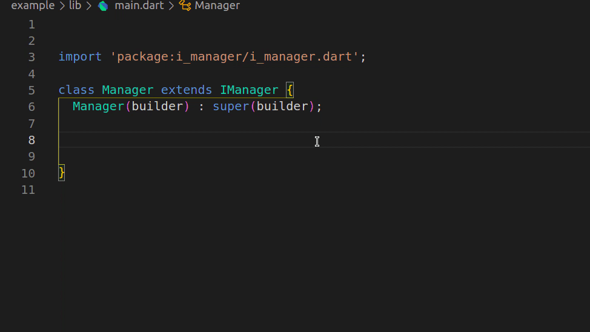
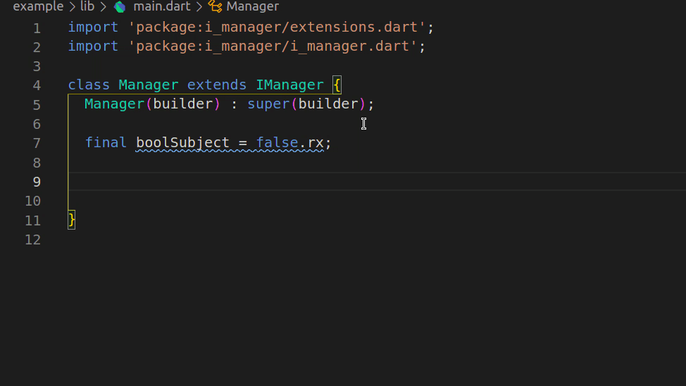

# i_manager

This package helps in sharing data through a widget tree using inherited widget.

<br>


# Usage

Add `MultiIManagerProvider` or `IManager` instance at the top of all the widgets you want to access the manager from.
<br>NOTE: if you want to share instances between many routes you should add the manager above the first widget (MaterialApp).

### Example 1

In this example LoginManager can be accessed from any widget.
```dart
void main() {
  runApp(MyApp());
}

class MyApp extends StatelessWidget {
  @override
  Widget build(BuildContext context) {
    return LoginManager((cxt) {
      return MaterialApp(
        title: 'IManager Demo',
        theme: ThemeData(
          primarySwatch: Colors.red,
          visualDensity: VisualDensity.adaptivePlatformDensity,
        ),
        home: MainPage(),
      );
    });
  }
}
```

### Example 2
In this example MainManager is accessible from Widget1, Widget2, Widget3, and Widget4.
```dart
class MainPage extends StatelessWidget {
  @override
  Widget build(BuildContext context) {
    return MainManager(
      (context) {
        /// We can also get instance of MainManager here
        final manager = context.getManager<MainManager>();
        return Scaffold(
          appBar: AppBar(
            title: Text('IManager Demo Main Page'),
          ),
          body: SingleChildScrollView(
            child: Column(
              children: [
                Widget1(),
                Widget2(),
                Widget3(),
                Widget4(),
              ],
            ),
          ),
        );
      },
    );
  }
}
```

### MultiIManagerProvider vs IManager

A nested IManager widget is the same as MultiIManagerProvider.
ie: MultiIManagerProvider just used to make it look prettier.

```dart
  Widget build(BuildContext context) {
    return MultiIManagerProvider(
      iManagersBuilder: [
        (child) => GeneralManager((cxt) => child),
        (child) => MainManager((cxt) => child),
        (child) => LoginManager((cxt) => child),
      ],
      child: MaterialApp(...),
    );
  }
```

<h4>same as</h4>

```dart
  Widget build(BuildContext context) {
    return LoginManager(
      (cxt) {
        return MainManager(
          (cxt) {
            return GeneralManager(
              (cxt) {
                return MaterialApp(...);
              },
            );
          },
        );
      },
    );
  }
```

### Rerender widget when value changed
In order to be able to rerender the widgets when a new value in manager has been changed. You need to add Rx [BehaviorSubject] then subscribe to it using [IManagerBuilder]. So everytime a new value added to the subject builder method will run again with a new value inside the snapshot.

Example:

Manager:

```dart
import 'package:flutter/material.dart';
import 'package:i_manager/extensions.dart';
import 'package:i_manager/i_manager.dart';

class LoginManager extends IManager {
  LoginManager(WidgetBuilder builder) : super(builder);
  final isLoggedIn = false.rx;
  @override
  void dispose() {
    isLoggedIn.close();
    super.dispose();
  }
}
```

UI:

```dart
import 'package:example/features/home/home_page.dart';
import 'package:example/features/login/login_manager.dart';
import 'package:example/features/login/login_page.dart';
import 'package:flutter/material.dart';
import 'package:i_manager/extensions.dart';
import 'package:i_manager/widgets/i_manager_builder.dart';

class MainPage extends StatelessWidget {
  @override
  Widget build(BuildContext context) {
    final loginManager = context.getManager<LoginManager>();
    return IManagerBuilder<bool>(
      subject: loginManager.isLoggedIn,
      builder: (context, snapshot) {
        if (snapshot.data) {
          return MyHomePage();
        } else {
          return LoginPage();
        }
      },
    );
  }
}

```

# IManagerBuilder vs StreamBuilder
<h3>
IManagerBuilder will take as params [BehavioralSubject] and builder while StreamBuilder will take [Stream] and Builder
</h3>
<h3>Also at the first widget render snapshot will be as following</h3>
IManagerBuilder
<ul>
<li>
ConnectionState: waiting
</li>
<li>
data: BehavioralSubject value
</li>
</ul>
StreamBuilder
<ul>
<li>
ConnectionState: waiting
</li>
<li>
data: null
</li>
</ul>
<br>

# Extension
The extensions in this package will help you to change any variable to BehavioralSubject of the same type by adding .rx at the end of it.
<br>
Also to be able to use method setValue for [BehavioralSubject] instead of .sink.add
<br>
<br>
NOTE: you have to add import 'package:i_manager/extensions.dart';  at the begging of the class

<br>

## Easy Import Extension
<br>
Instead of writing the import manually start typing importIManagerExtension and press enter then delete it(when doing so the import will be added to the class).
<p align='center'>
 
</p>
<br>

## Don't forget to close all the subjects in dispose method

<p align='center'>
 
</p>
<br>

# Acknowledgments

This package was created and maintained by [Kamal Sayed](https://github.com/kamalsayed98).

# Bugs or Requests

If you encounter any problems feel free to open an [issue](https://github.com/kamalsayed98/i_manager/issues/new?template=bug_report.md). If you feel the library is missing a feature, please raise a [ticket](https://github.com/kamalsayed98/i_manager/issues/new?template=feature_request.md). Pull requests are also welcome.